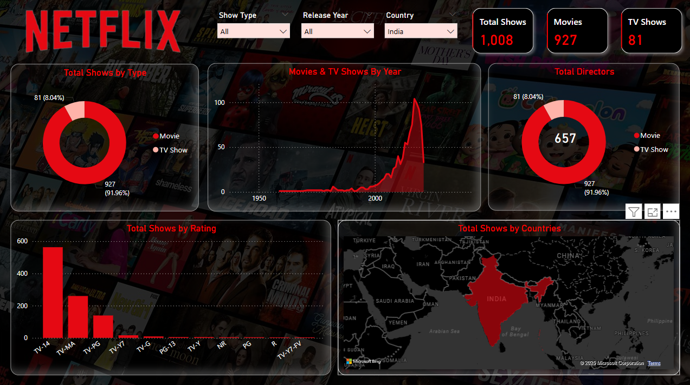

# Netflix_Analysis
Netflix Analysis Dashboard (Power BI) This project is a comprehensive analysis of Netflix content available, built using Power BI. The interactive dashboard provides valuable insights into the distribution and trends of Movies and TV Shows over the years.
# Tools Used
1)Power BI Desktop

2)Dataset: Netflix titles dataset (can be sourced from Kaggle or other open datasets)

3)Data Cleaning & Transformation: Power Query

4)Visuals: Donut Charts, Line Graphs, Bar Charts, Map Visualizations, Filters

Files
Power BI dashboard file link (view dashboard here): https://app.powerbi.com/view?r=eyJrIjoiYWNlODkyZTgtN2NhYS00ZmU1LTg1ZjMtMmNlMTIwOTFmMjBiIiwidCI6ImRhYTU5MmNhLWRlN2ItNGM1NC04ODM2LTkxYTY2OTBmZTE5NyJ9

